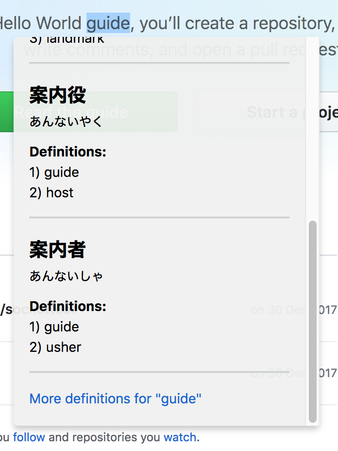
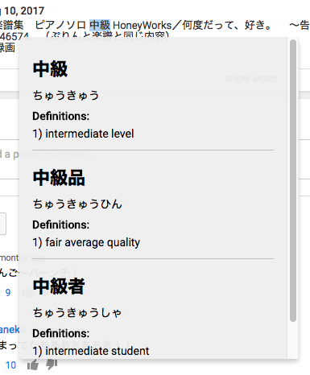
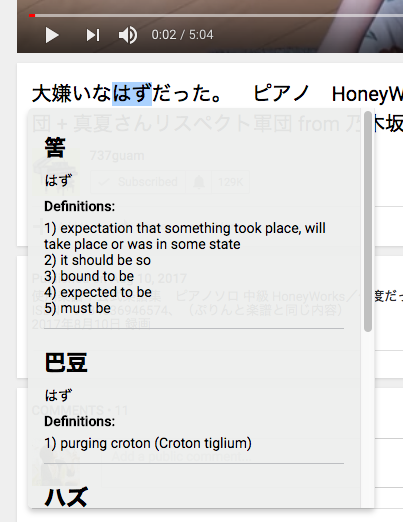

# weeb

Google Chrome plugin for learning Japanese words for English speakers.
Data provided by Jisho API.

## Features

<ul>
    <li>Find Japanese word suggestions from English word</li>
    <li>Double click on Japanese Kanji to obtain Furigana</li>    
    <li>Find meaning of Japanese words in Hiragana or Katakana</li>
</ul>

## Example

    
    
    
    

## How to use

Double click on a word to open dictionary popup.
